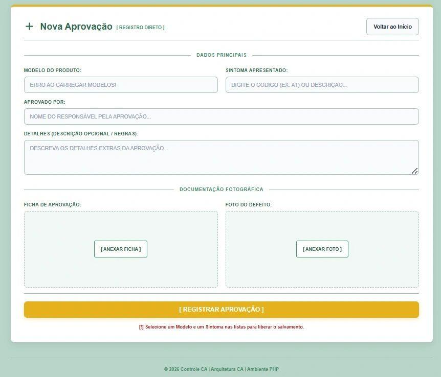
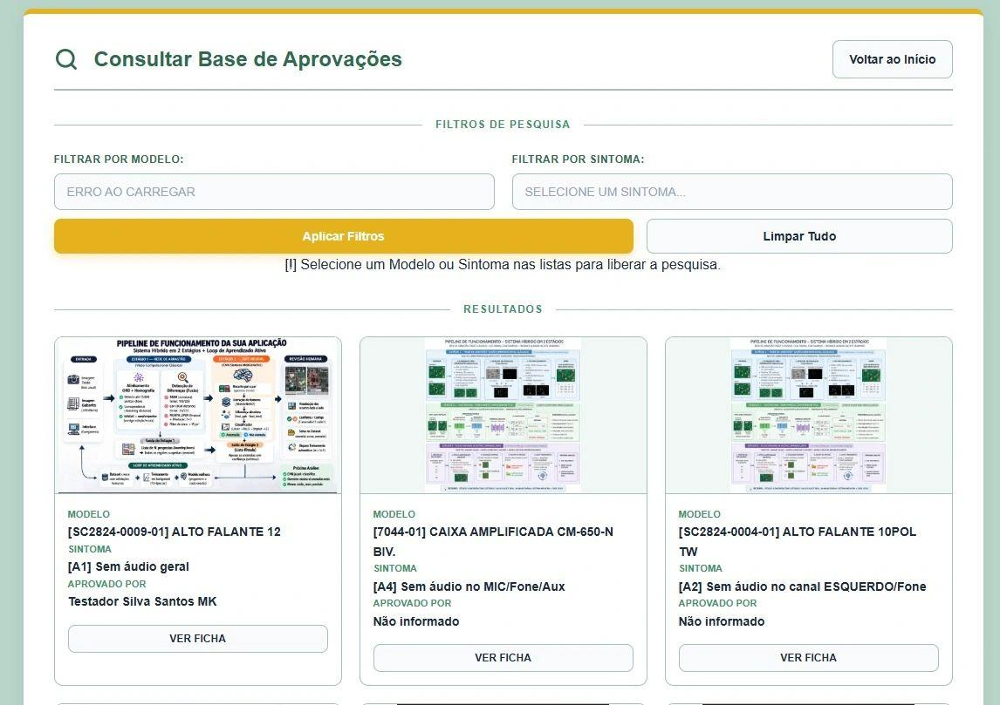
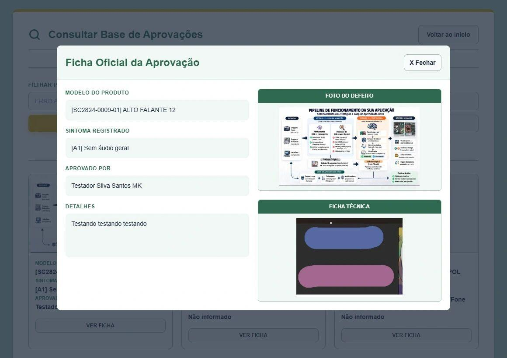

# Central de Aprovações - CA

Sistema web corporativo para **registro, armazenamento e consulta de aprovações técnicas de produtos**, com suporte a documentação fotográfica, ficha técnica, sintomas de falha e rastreabilidade das decisões de aprovação.

O projeto foi desenvolvido com foco em ambientes industriais onde aprovações técnicas precisam ser registradas de forma padronizada, consultável e visualmente organizada.

---

## Visão geral

A **Central de Aprovações (CA)** centraliza registros que normalmente ficam espalhados em conversas, planilhas, fotos soltas ou documentos sem padrão único.

Com o sistema, é possível:

- Cadastrar uma nova aprovação técnica.
- Vincular o registro a um modelo de produto.
- Informar o sintoma apresentado.
- Registrar o responsável pela aprovação.
- Anexar ficha de aprovação e foto do defeito.
- Consultar registros salvos por modelo ou sintoma.
- Visualizar uma ficha oficial com os dados e imagens do registro.

---

## Demonstração visual

### Tela inicial

A tela inicial apresenta as duas ações principais do sistema: criação de novo registro e consulta da base de aprovações.


### Cadastro de nova aprovação

Formulário para registrar modelo, sintoma, responsável, detalhes e anexos fotográficos.



### Consulta da base de aprovações

Área de pesquisa com filtros por modelo e sintoma, exibindo os registros encontrados em cards.



### Ficha oficial da aprovação

Modal de visualização com os dados completos da aprovação, foto do defeito e ficha técnica anexada.



---

## Funcionalidades principais

- **Registro de aprovações técnicas** com dados estruturados.
- **Upload de documentação fotográfica**, separando foto do defeito e ficha de aprovação.
- **Consulta de aprovações salvas** com filtros por modelo e sintoma.
- **Visualização em cards**, facilitando a leitura rápida dos registros.
- **Ficha oficial em modal**, reunindo dados e anexos em uma visão única.
- **Validação visual no cliente**, bloqueando ações até que os campos obrigatórios sejam preenchidos.
- **Arquitetura organizada por camadas**, separando páginas, serviços, configurações, APIs e arquivos públicos.

---

## Tecnologias utilizadas

- **PHP Vanilla**
- **JavaScript**
- **HTML**
- **CSS**
- **Supabase** para persistência de dados e arquivos
- **cURL** para comunicação entre PHP e serviços externos

---

## Arquitetura do projeto

```txt
Central-de-Aprovacoes-CA/
├── public/
│   └── css/
├── src/
│   ├── api/
│   ├── config/
│   ├── services/
│   └── views/
├── buscar.php
├── cadastrar.php
├── index.php
├── estrutura_projeto.md
└── README.md
```

### Responsabilidade das camadas

| Camada | Responsabilidade |
|---|---|
| `index.php` | Página inicial do sistema |
| `cadastrar.php` | Tela de cadastro de novas aprovações |
| `buscar.php` | Tela de consulta e visualização da base |
| `src/config/` | Configurações centrais do projeto |
| `src/services/` | Comunicação com serviços externos, como Supabase |
| `src/api/` | Endpoints PHP usados por requisições assíncronas |
| `src/views/` | Componentes visuais reutilizáveis |
| `public/` | Arquivos estáticos, CSS e possíveis uploads temporários |

---

## Fluxo de uso

1. O usuário acessa a tela inicial.
2. Seleciona **Novo Registro** para cadastrar uma aprovação.
3. Informa o modelo do produto, sintoma, responsável e detalhes.
4. Anexa a ficha de aprovação e a foto do defeito.
5. O registro é salvo na base.
6. Pela tela **Base de Dados**, o usuário filtra os registros por modelo ou sintoma.
7. Ao clicar em **Ver Ficha**, o sistema exibe a ficha oficial da aprovação.

---

## Objetivo do projeto

O objetivo da Central de Aprovações é reduzir a dispersão de informações técnicas e criar uma base única de consulta para decisões de aprovação.

Em um processo produtivo, esse tipo de sistema ajuda a:

- Melhorar a rastreabilidade das aprovações.
- Padronizar o registro das informações.
- Reduzir dependência de arquivos manuais e conversas isoladas.
- Facilitar consultas futuras por produto, falha ou sintoma.
- Apoiar equipes de qualidade, produção, engenharia e assistência técnica.

---

## Como executar localmente

> Ajuste os comandos conforme o ambiente usado no servidor ou computador local.

### 1. Clone o repositório

```bash
git clone https://github.com/carlosdaniel003/Central-de-Aprovacoes-CA.git
```

### 2. Acesse a pasta do projeto

```bash
cd Central-de-Aprovacoes-CA
```

### 3. Configure as credenciais

Crie ou ajuste os arquivos de configuração dentro de `src/config/` com as credenciais necessárias para comunicação com o Supabase.

> Não envie chaves de API, tokens ou credenciais reais para o GitHub.

### 4. Inicie um servidor PHP local

```bash
php -S localhost:8000
```

### 5. Acesse no navegador

```txt
http://localhost:8000
```

---

## Observações de segurança

- Dados sensíveis devem ficar apenas em arquivos de configuração protegidos.
- Chaves de API não devem ser expostas no frontend.
- A validação visual no JavaScript melhora a experiência, mas a validação final deve ocorrer no backend.
- O backend deve ser a fonte de verdade para gravação, consulta e persistência dos dados.

---

## Status do projeto

Projeto em desenvolvimento/evolução.

A estrutura atual já contempla o fluxo principal de cadastro, consulta e visualização das aprovações.

---

## Autor

**Carlos Daniel**  
Desenvolvedor Full Stack | Técnico em Eletrônica

GitHub: [@carlosdaniel003](https://github.com/carlosdaniel003)
